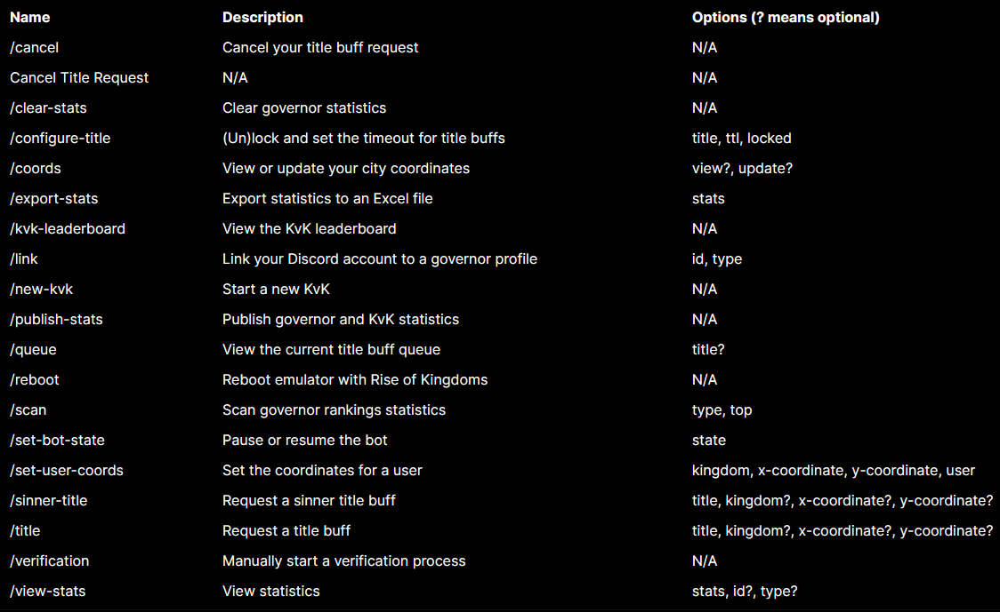

  <h1>roka</h1>
  <h4>
    Rise of Kingdoms bot to manage titles through Discord.
  </h4>

  
  
  

  <a href="#-about">About</a> • 
  <a href="#features">Features</a> •
  <a href="#license">License</a>

## 🤖 About

Rise of Kingdoms bot to manage titles and DKP and through Discord.

> [!IMPORTANT]  
> This project is deprecated due to the game having their own system to manage titles. DKP tracking still works but is no longer maintained.

**Disclaimer:** This bot is an independent project and is not affiliated, endorsed, or associated with Rise of Kingdoms, its developers, or any official entities related to the game. By using this bot, you acknowledge and agree that you do so at your own risk. The developer of this bot assumes no responsibility or liability for any consequences, penalties, or actions that may result from its usage.

## Features

## License

This project is licensed under the MPL-2.0 License - see the [LICENSE](LICENSE) file for details.
